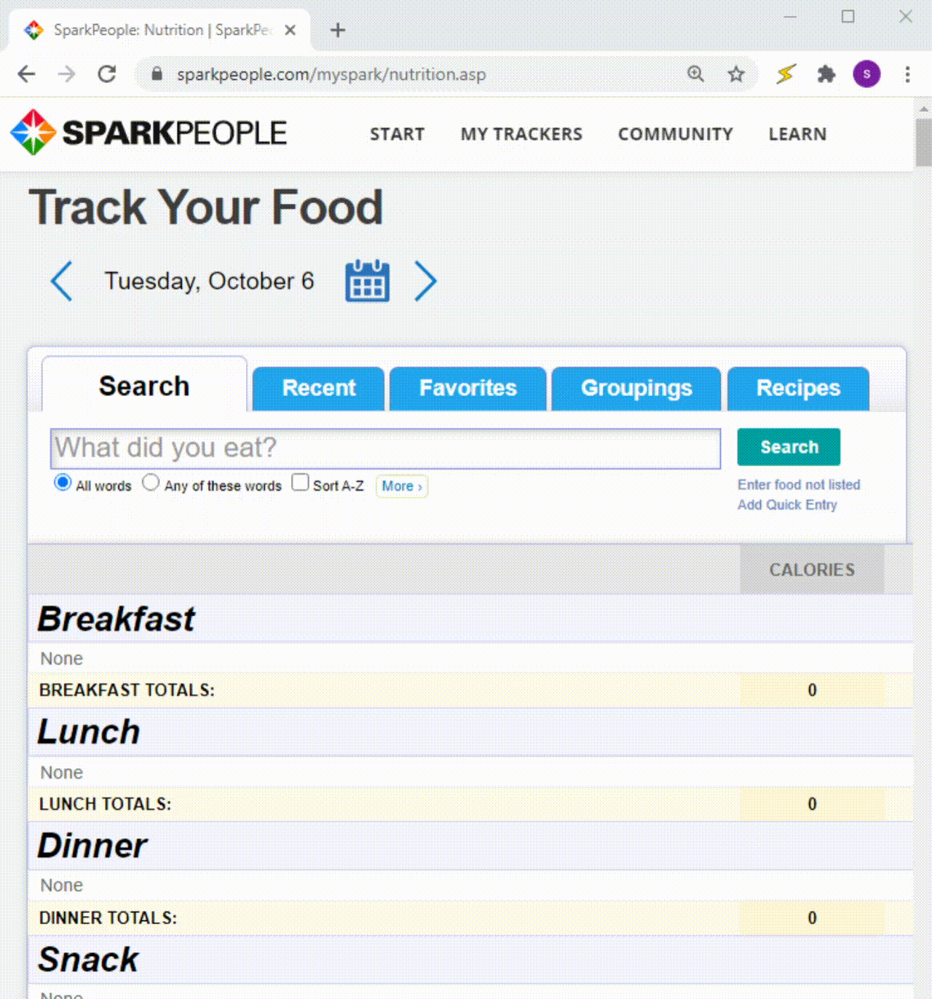
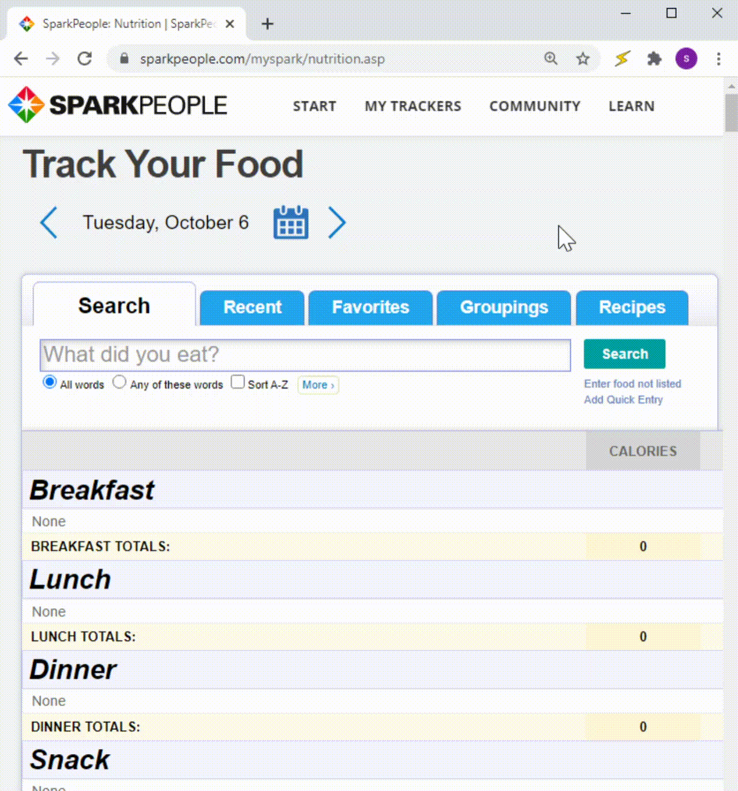

  

<h1 align="center">Spark Logger</h1>

Spark Logger is a Chrome extension for easier and more efficient food tracking on [Sparkpeople.com](https://www.sparkpeople.com).

The extension acts as an alternative to the *Favorites* tab, which only allows food to be logged one at a time, and enables simultaneous logging of multiple foods.
  

Before | After
:-:|:-:
 | 

## Installation
:rocket: Version 1.0 is live on the Chrome Web Store! You can find it [here](https://chrome.google.com/webstore/detail/spark-logger/lpppdeadccdckckcllnoeadmikncejlo).

## Features
- Simultaneous multi-entry logging
- Live, visual warnings
### Upcoming
- Specifying units

## Usage
1. Visit https://www.sparkpeople.com/myspark/nutrition.asp (A Sparkpeople account is required)
2. Click the extension icon 
3. Enter food name followed by amount (the unit defaults to grams), then hit **Enter** 
    * Multiple entries can also be pasted in (each entry must be on a separate line)
    * Check Favorites warnings:
      - :question:: no matching food in favorites
      - :exclamation:: food has multiple matches in favorites
      - :white_check_mark:: all good!
4. Click the **Log entries!** button to find and log the foods in Favorites

## Notice of Non-Affiliation and Disclaimer
Spark Logger is not affiliated, associated, authorized, endorsed by, or in any way officially connected with Sparkpeople, Inc, or any of its subsidiaries or its affiliates.
The name Sparkpeople as well as related names, marks, emblems and images are registered trademarks of their respective owners.

---
Spark Logger logo assets provided by freepik.com.